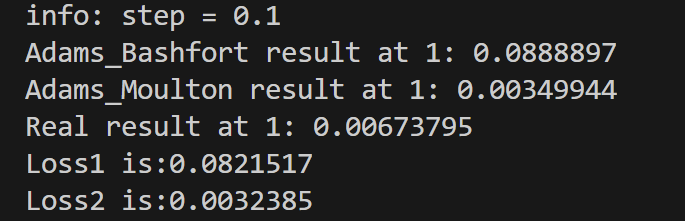
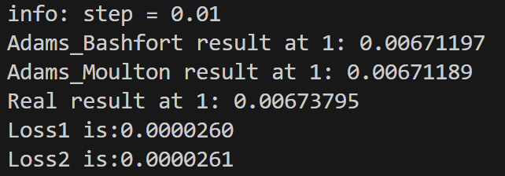
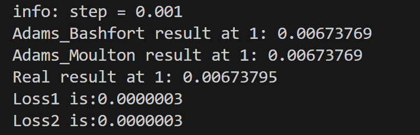
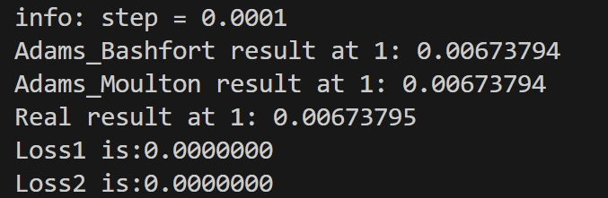

# Adams Method
## 使用三阶Adams线性多步法,外插和内插,求方程

$$ u'=-5u \\
u(0)=1 
$$
### 外插法:
$$
    u[i + 1] = u[i] + H / 24 * (55 * f[i] - 59 * f[i - 1] + 37 * f[i - 2] - 9*f[i - 3]); $$
由于使用3阶,需要前四个点,可以先使用欧拉法预测这四个点,然后后面再用Adams公式.
### 内插法:
$$
u[i + 1] = u[i] + H / 720 * (251 * f[i + 1] + 646 * f[i] - 264 * f[i - 1] + 106 * f[i - 2] - 19 * f[i - 3]);
$$
内插法包含一个隐方程,需要用到f(n+1),可以使用外插法先预测u(n+1),获得f(n+1),然后再用内插法的公式来计算出u(n+1).
### 数值结果

可以看到全局误差控制在O(h^3),内插法在步长比较大的时候,更准确一些.