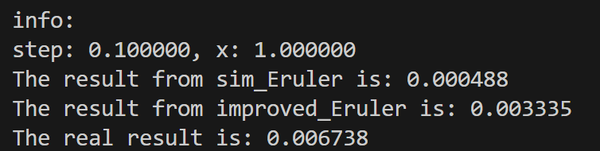
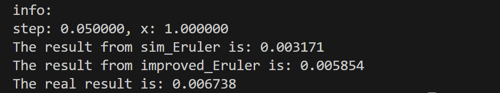

# 欧拉法和改进欧拉法程序设计
## 实验背景
     df/dx = -5*f ，x from [0,1]
     f(0) = 1
根据解析法，求得f(x) = exp(-5*x)
## 文件说明
编译指令： g++ -o main eruler.cpp  
主文件在eruler.cpp, sim_Eruler()表示简单欧拉法；improved_Eruler()表示改进欧拉法，步长是h=step。 
欧拉法的截断误差是O(h^2)，累计误差是O(h);
改进欧拉法的截断误差是O(h^3),累计误差是O(h^2).
## 实验结果

步长分别是0.1，0.05，0.01；

 从实验结果可以看到，在最远端，改进欧拉法比欧拉法精度要好。
    累计误差也确实控制在O(h^2),