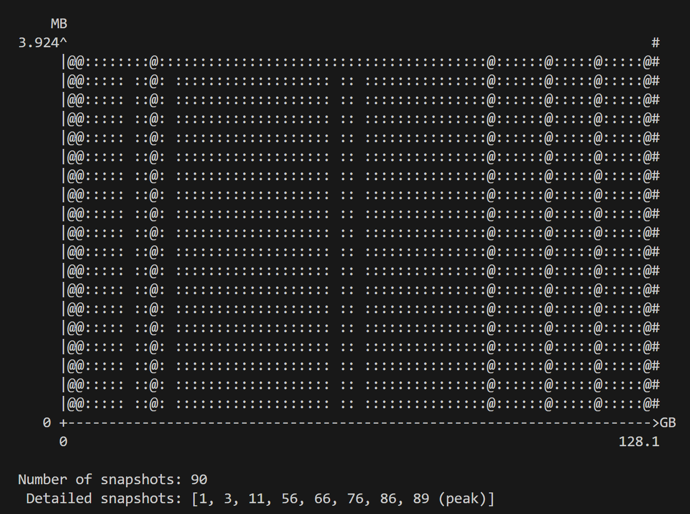
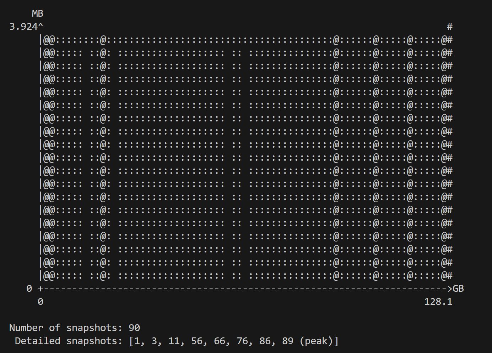
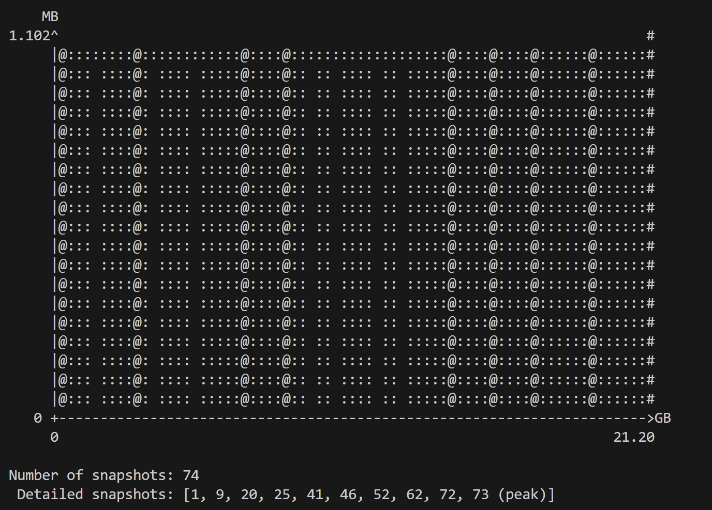
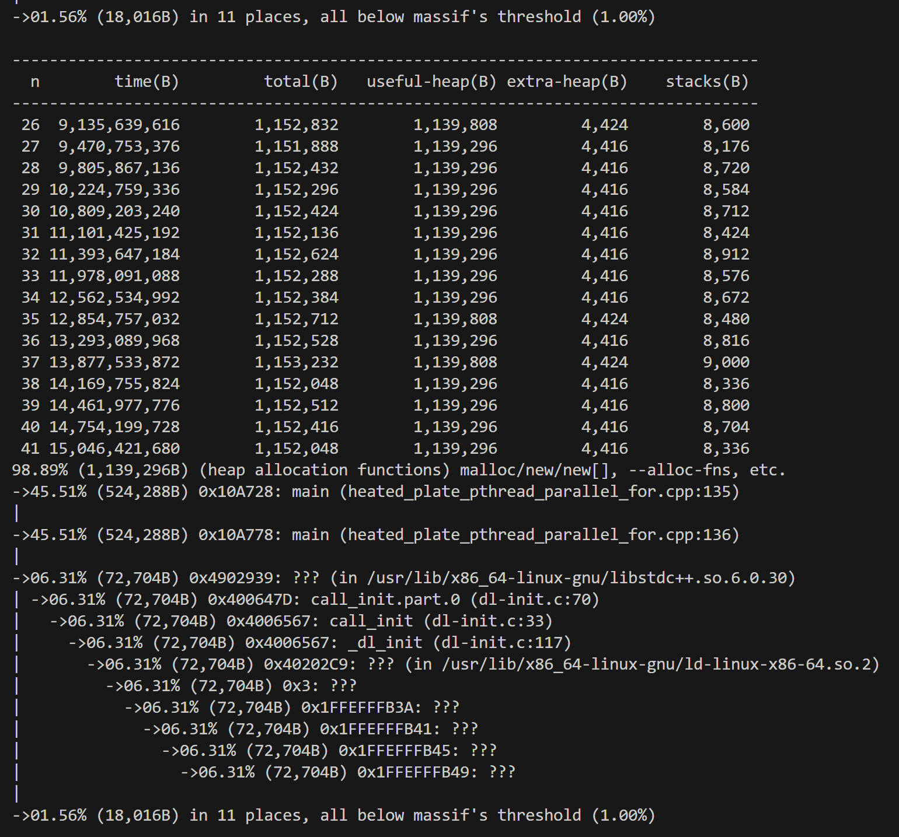

# **中山大学计算机院本科生实验报告**

**（2024学年秋季学期）**

课程名称：高性能计算程序设计 **批改人：**

|       |     |              |     |
|-------|-----|--------------|-----|
| 实验  |   heated_plate_openmp并行diy实现  | 专业（方向） |   信息计算科学  |
| 学号  |    22336173 | 姓名         |  罗弘杰   |
| Email |   3133974071@qq.com  | 完成日期     |   2024-11-27  |
## Heated_plate_openmp任务的Pthread并行
### 原始版本（Openmp）

    Number of processors available = 16
    Number of threads =              16
    MEAN = 74.949900

    Iteration  Change

         1  18.737475
         2  9.368737
         4  4.098823
         8  2.289577
        16  1.136604
        32  0.568201
        64  0.282805
       128  0.141777
       256  0.070808
       512  0.035427
      1024  0.017707
      2048  0.008856
      4096  0.004428
      8192  0.002210
     16384  0.001043

     16955  0.001000

    Error tolerance achieved.
    Wallclock time = 60.274613

使用之前修改的parallel for的框架。更改了循环内的对u矩阵赋值的函数(matrix_map_matrix)，代替原来的openmp方法，发现计算消耗时间增多，时间增长到300多秒。
``` cpp
/*
    输入二维矩阵遍历的index，以及二维矩阵的地址
*/
void *matrix_map_matrix(void *args){ //a function to map value to a matrix
    struct index_in *index = (struct index_in *)args;
    struct matrix2matrix *argues = (struct matrix2matrix *)index->args;
    int i, j;
    int row_increment = index->index_diy->row_increment;
    int col_increment = index->index_diy->col_increment;
    int row_start = index->index_diy->row_start;
    int col_start = index->index_diy->col_start;
    int row_end = index->index_diy->row_end;
    int col_end = index->index_diy->col_end;
    double **dst = argues->dst;
    double **src = argues->src;

    for (i = row_start; i < row_end; i += row_increment)
    {  
        for (j = col_start; j < col_end;j+=col_increment)
        {
            dst[i][j] = src[i][j] ;
        }
    }
    return NULL;
}
```

         1  18.737475
         2  9.368737
         4  4.098823
         8  2.289577
        16  1.136604
        32  0.568201
        64  0.282805
       128  0.141777
       256  0.070808
       512  0.035430
      1024  0.017712
      2048  0.008824
      4096  0.004677
      8192  0.002722

     11578  0.000931

    Error tolerance achieved.
    Wallclock time = 375.170502


这是因为pthread写的parallel for函数在不断的创建销毁子线程，严重损耗系统性能。 \
我们考虑使用线程池来实现pthread线程的创建，保持（使用伪工作线程），分配工作和销毁。\
线程池包含了条件变量notify，这是为了让在任务加入的时候，工作线程能及时唤醒。在任务队列为空的时候，工作线程及时休眠。
线程池还包含了条件变量unfinished，这个条件变量标记了一批任务是否完成，一批完成才能运行下一批任务的投放，因为这个并行计算任务前后的计算任务是**顺序相关的**。
线程池从github上获取https://github.com/JunhuaiYang/PthreadPool，增加了pool_wait()的实现，确保工作任务一批一批的并行处理。
```cpp
/*
    线程池管理，保证pthread线程不会频繁的创建，销毁。
*/
class PthreadPool
{
private:
    pthread_mutex_t lock;                                   // 互斥锁,保证公共变量临界区安全
    pthread_cond_t notify;                                  // 条件变量，标记是否有任务进入
    std::queue<Pthreadpool_Runable> thread_queue;           // 任务队列
    pthread_t *threads;                                     // 任务数组
    int shutdown;                                           // 表示线程池是否关闭
    static void *threadpool_thread(void *threadpool);       // 运行函数

public:
    PthreadPool();
    ~PthreadPool();
    bool is_queue_empty();
    int thread_num;                                                  // 线程数量
    int running_num;                                                 // 正在运行的线程数
    int unfinished_task;                                               //未完成的任务
    pthread_cond_t cond;                                             // 标记一批任务是否完成
    int Init(unsigned int num);                                       // 初始化线程池
    int AddTask(void* (*function)(void *), void *argument = nullptr); // 加入任务
    int Destory(PthreadPool_Shutdown flag = graceful_shutdown);      // 停止正在进行的任务并摧毁线程池
    void pool_wait();  //等待所有的在线程池的任务都被实现，否则阻塞
};
```
最终的计算效果如下图显示，可以看到加速还是不错的，达到openmp一个量级的水平：


         1  18.737475
         2  9.368737
         4  4.098823
         8  2.289577
        16  1.136604
        32  0.568201
        64  0.282805
       128  0.141777
       256  0.070808
       512  0.035427
      1024  0.017707
      2048  0.008856
      4096  0.004428
      8192  0.002210
     16384  0.001043

     16955  0.001000

    Error tolerance achieved.
    Wallclock time = 54.366369

输出矩阵的右下角25个元素，验证正确性 \
HEATED_PLATE_OPENMP: \
  Normal end of execution. \
99.9699 99.9774 99.9850 99.9925 100.0000  \
99.9774 99.9831 99.9887 99.9944 100.0000  \
99.9850 99.9887 99.9925 99.9962 100.0000  \
99.9925 99.9944 99.9962 99.9981 100.0000  \
100.0000 100.0000 100.0000 100.0000 100.0000  


   

## MPi实现并行计算

###  分析
分两个部分，0号进程负责分配初始矩阵，管理工作进程的通信，值得注意的是
- mpi传输时一般是连续内存读取，在分配矩阵的时候用连续分配的方法，不要double new(new两次)。
- 具体的计算逻辑是 
    1. 0线程分配矩阵，计算Mean.
    2. 0进程发送矩阵w的分块（根据进程数目平均分配）给各个工作进程。
    3. 工作进程获得w的分块，赋值给u，根据有限元的网格计算公式计算结果w矩阵，最后比较u和w各个元素之间的 \
    最大不同max_diff，返回max_diff和计算之后的w矩阵给0进程。
    4. 0进程计算所有max_diff中最大的一个，赋值给diff，返回的矩阵w，赋值给矩阵w,比较diff和epsilon的大小，若满足diff < eps,则计算收敛结束，0进程发送signal = -1给所有进程，工作进程收到-1信号就等待矩阵输入来重复计算。否则重复第2步。
``` cpp
if (my_rank ==0){
    ...

// 分配连续内存
    double *w = (double *)malloc(M * N * sizeof(double));
    ... //分配初始mean的矩阵
    while (epsilon <= diff)
    {
        diff = 0;
        // 发送矩阵u, w，让其他奴隶进程计算Mean, 有限元表格计算，赋值，计算max_diff
        for (int i = 0; i < comm_sz - 1; i++) { // 分配矩阵A的行
            // my_diff[i] = 0;
            begin_Arow = std::max(i * avg_rows - 1, 0);                                               
            end_Arow = (i + 1 == comm_sz - 1) ? M : (i + 1) * avg_rows;
            end_Arow = std::min(end_Arow + 1, M);
            // 为了使用周围的数据，需要将区域上下两行多的数据传送过去。
            
            MPI_Send(&end_Arow, 1, MPI_INT, i + 1, 10, MPI_COMM_WORLD); // end_Arow可以作为信号，如果是-1，则奴隶进程结束

            MPI_Send(&w[begin_Arow * N], (end_Arow - begin_Arow) * N, MPI_DOUBLE, i + 1, 1, MPI_COMM_WORLD);

        }
        for (int i = 0; i < comm_sz - 1; i++) {  //return the std::max diff[i]
            begin_Arow = std::max(i * avg_rows - 1, 0);                                                                                                                                                                                                                                                                                                                      
            end_Arow = (i + 1 == comm_sz - 1) ? M : (i + 1) * avg_rows;
            end_Arow = std::min(end_Arow + 1, M);
            MPI_Recv(&my_diff[i], 1, MPI_DOUBLE, i + 1, 3, MPI_COMM_WORLD, &status);
            MPI_Recv(&w[(begin_Arow+1) * N], (end_Arow - begin_Arow -2) * N, MPI_DOUBLE, i + 1, 4, MPI_COMM_WORLD, &status);
            diff = std::max(my_diff[i], diff);
        }

        iterations++;
        if ( iterations == iterations_print )
        {
            printf ( "  %8d  %f\n", iterations, diff );
            iterations_print = 2 * iterations_print;
        }
    }
    signal = -1;
    printf("At %d , episilon err reached, gonna kill all processes\n", iterations);
    for(int i = 0; i < comm_sz - 1; i++){
        MPI_Send(&signal, 1, MPI_INT, i + 1, 10, MPI_COMM_WORLD); // end_Arow可以作为信号，如果是-1，则奴隶进程结束
    }
    free(w);
    free(u);
}
```
注意由于需要用元素4周的其他元素作为网格计算，所有接受矩阵要在行维度上增加两行。

``` cpp
else { // 非 0 号进程的代码 所有的索引满足左闭右开要求
    int real_begin_Arow = my_rank == 1 ? 1 : avg_rows * (my_rank - 1);  //实际计算的元素初始
    int virtual_begin_Arow = real_begin_Arow - 1; //需要的上计算元素
    int real_end_Arow = my_rank == comm_sz - 1 ? M - 1 : (avg_rows * my_rank); //实际计算元素的上界
    int virtual_end_Arow = real_end_Arow + 1;  //需要的下计算元素
    double *local_w = (double *)malloc((virtual_end_Arow - virtual_begin_Arow) * N * sizeof(double)); // 分配子矩阵 w 的内存
    double *local_u = (double *)malloc((virtual_end_Arow - virtual_begin_Arow) * N * sizeof(double)); // 分配子矩阵 u 的内存
    double max_diff;
    int M_len = virtual_end_Arow - virtual_begin_Arow;  //接受矩阵维度
    while (true)
    {
        // 接收分配的行信息，判断是否结束，正常发送正确的最后行，结束的时候输入信号-1
        MPI_Recv(&signal, 1, MPI_INT, 0, 10, MPI_COMM_WORLD, &status);
        
        if (virtual_end_Arow != signal)
        { // 结束信号
            printf("%d process received quit signal %d\n", my_rank, signal);
            break;
        }

        // 接收子矩阵数据到local_u,后面计算的结果放在local_w
  l    MPI_Recv(local_u, (virtual_end_Arow - virtual_begin_Arow) * N, MPI_DOUBLE, 0, 1, MPI_COMM_WORLD, &status);

        max_diff = 0.0;
        for (int i = 0; i < M_len; i++)
        {
            if(i == 0 || i ==M_len-1){  //local_w边界
                for (int j = 0; j < N ; j++) {
                    local_w[i * N + j] = local_u[i * N + j];
                }
                continue;
            }
            for (int j = 0; j < N ; j++) {
                if(j == 0||j==N-1){ //local_w边界
                    local_w[i * N + j] = local_u[i * N + j];
                    continue;
                }
                // 以下为网格计算结果
                local_w[i * N + j] = 0.25 * (local_u[(i - 1) * N + j] + local_u[(i + 1) * N + j] +  
                                             local_u[i * N + (j - 1)] + local_u[i * N + (j + 1)]);
                double diff = fabs(local_u[i * N + j] - local_w[i * N + j]);
                if (diff > max_diff) {
                    max_diff = diff; // 更新最大差异
                }
            }
        }
        MPI_Send(&max_diff, 1, MPI_DOUBLE, 0, 3, MPI_COMM_WORLD);                                                         // 发送最大差异
        MPI_Send(&local_w[N], (real_end_Arow - real_begin_Arow) * N, MPI_DOUBLE, 0, 4, MPI_COMM_WORLD); // 发送更新后的子矩阵 w
    }
    printf("%d process ending\n", my_rank);
    free(local_w); // 释放子矩阵内存
    free(local_u);
}
```

### 运行结果
         1  18.737475
         2  9.368737
         4  4.098823
         8  2.289577
        16  1.136604
        32  0.568201
        64  0.282805
       128  0.141777
       256  0.070808
       512  0.035427
      1024  0.017707
      2048  0.008856
      4096  0.004428
      8192  0.002210
     16384  0.001043
    At 16955 , episilon err reached, gonna kill all processes
    Elapsed time: 17.741727 seconds

对比openmp版本：

         1  18.737475
         2  9.368737
         4  4.098823
         8  2.289577
        16  1.136604
        32  0.568201
        64  0.282805
       128  0.141777
       256  0.070808
       512  0.035427
      1024  0.017707
      2048  0.008856
      4096  0.004428
      8192  0.002210
     16384  0.001043
     16955  0.001000
    Error tolerance achieved.
    Wallclock time = 60.274613

可以看到正确性得到保证，同时计算时间更快。

### 后续优化
考虑到这里对矩阵的操作都是二维遍历，然后对矩阵元素进行操作，后续可以考虑使用一个lambda函数传参到一个二维遍历函数traverse()实现更自由的操作 

## 性能测试
对任务一用Pthread实现parallel_for进行性能测试，包括时间测试，内存测试。
### 时间测试
测试程序在不同问题规模和计算规模的情况下，计算时间的情况，部分情况时间太长无法测得 
``` makefile
run: //makefile
	for n in 1, 2, 4, 8, 16; do \
		for size in 128 256 512 1024 2048 4096 8192; do \
			echo "Running program with size $$size and $$n threads" | tee -a output.txt; \
			./$(PROGRAM) $$size $$size $$n | tee -a output.txt; \
		done; \
		echo "End of program with $$n threads" | tee -a output.txt; \
		echo "" | tee -a output.txt; \
	done; \
	echo "End of program" | tee -a output.txt; \
	echo "" | tee -a output.txt;
```
| 矩阵维度 | 1 核心 (秒) | 2 核心 (秒) | 4 核心 (秒) | 8 核心 (秒) | 16 核心 (秒) |
|----------|-------------|-------------|-------------|-------------|--------------|
| 128      | 1.472873    | 0.979901    | 0.795760    | 0.891577    | 1.884200     |
| 256      | 11.536146   | 6.826970    | 4.473302    | 8.035092    | 8.782962     |
| 512      | 78.093475   | 42.615858   | 21.921012   | 15.068684   | 27.455385    |
| 1024     | 322.881929  | 174.309762  | 96.825203   | 59.636986   | 74.984984    |
| 2048     | 1273.401172 | 666.447201  | 347.250282  | 214.609258  | 246.510050   |
| 4096     | 2930.082439 | 2654.926696 | 1391.575813 | 791.794789  | 822.905625   |
| 8192     |             | 10927.505105|             | 2950.624220 | 2230.558220  |
### 内存测试
使用 Valgrind 进行内存分析
可以使用以下命令来启动 Valgrind，分析程序的内存使用情况，尤其是堆内存消耗：

这里测试500 500 8线程的计算问题
```bash
valgrind --tool=massif --time-unit=B --stacks=yes ./main 500 500 8
```
命令解析：
- --tool=massif：指定使用 massif 工具来分析内存消耗。
- --time-unit=B：以字节（B）为单位来显示内存消耗量。
- --stacks=yes：启用栈内存的分析，帮助捕捉栈上的内存消耗。
- ./your_exe：这是你要分析的可执行文件。


massif 输出日志 (massif.out.pid) 和 ms_print 打印
当程序运行时，massif 会生成一个输出文件，通常命名为 massif.out.pid，其中 pid 是进程的 ID。这份文件包含了程序在不同时间点的内存消耗数据。

使用 ms_print 命令来解析和可视化该日志文件：
``` bash
ms_print massif.out.pid
```

在计算500* 500的任务 使用8个线程

设计的并行方式是一开始分配了2个500*500的double矩阵，消耗共4MB左右，图片说明程序没有堆溢出的风险。
计算500 * 500的任务，使用4个线程

可以看到内存消耗基本一致，说明线程数量对内存消耗量影响不大。
再考虑256* 256的任务，用8线程计算

可以看到内存消耗减少到了原来的1/4
对于M * N的问题规模，内存需求是O(M * N)
最后查看内存分配的来源

可以看到98%以上的内存都是堆分配产生的，这之间的大部分又是开辟两个矩阵产生的